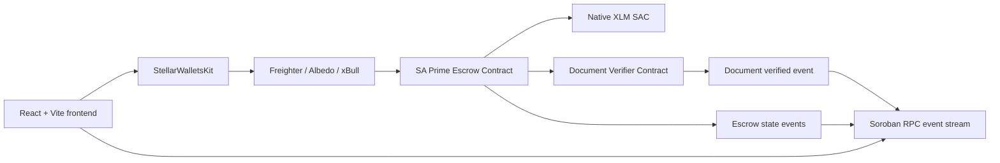
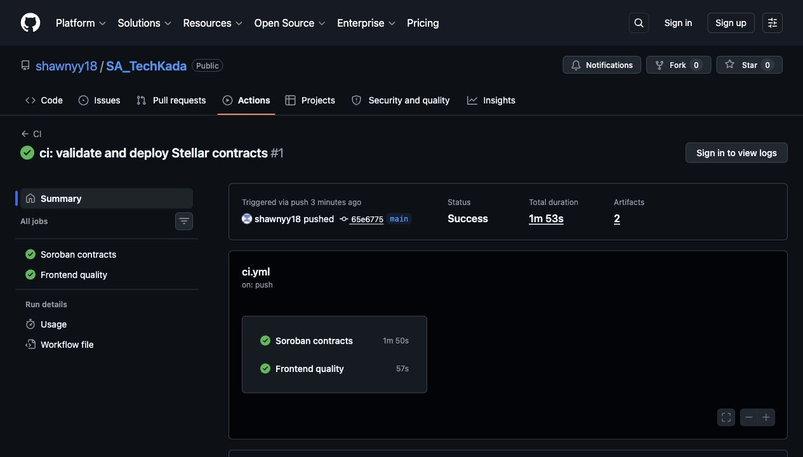
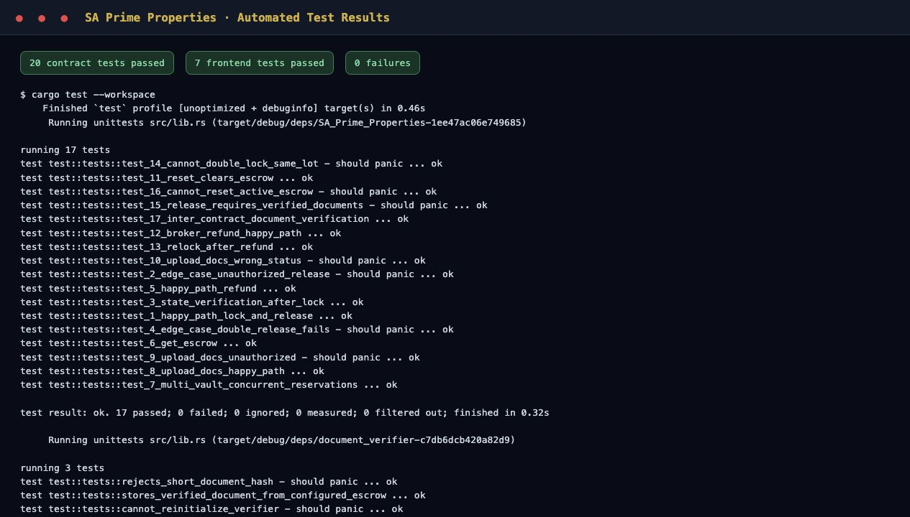
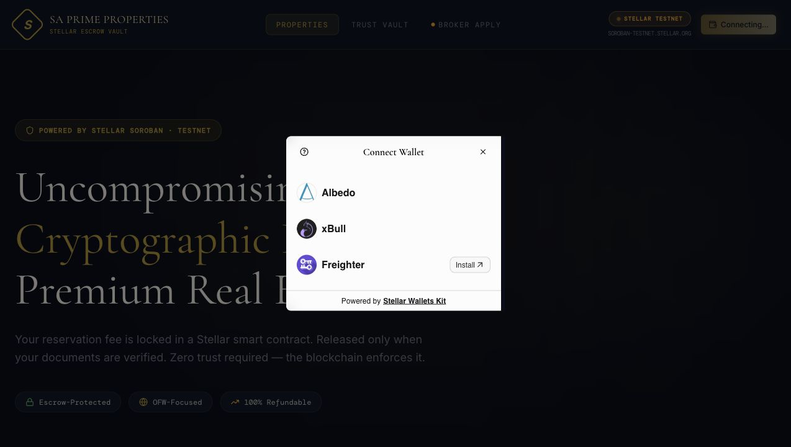

# SA Prime Properties

[](https://github.com/shawnyy18/SA_TechKada/actions/workflows/ci.yml)
[](https://sa-tech-kada.vercel.app)
[](https://stellar.expert/explorer/testnet)

Cryptographic XLM escrow for premium Philippine real estate. Buyers reserve a property through a noncustodial Stellar wallet, brokers anchor document fingerprints on-chain, and funds can only be released after an independent verifier contract approves the document record.

## Submission Links

- **Public repository:** [github.com/shawnyy18/SA_TechKada](https://github.com/shawnyy18/SA_TechKada)
- **Live application:** [sa-tech-kada.vercel.app](https://sa-tech-kada.vercel.app)
- **One-minute demo video:** [Watch or download the repository demo](https://github.com/shawnyy18/SA_TechKada/blob/main/docs/sa-prime-properties-demo.mp4?raw=1)
- **Successful CI run:** [GitHub Actions run #1](https://github.com/shawnyy18/SA_TechKada/actions/runs/27476020503)
- **Escrow contract:** [`CBOLG3UAH6JRTZ45CHKGTUMNUKZUFK67XDBZ4FCC7O4WXIOG4YYMQG4J`](https://stellar.expert/explorer/testnet/contract/CBOLG3UAH6JRTZ45CHKGTUMNUKZUFK67XDBZ4FCC7O4WXIOG4YYMQG4J)
- **Document verifier:** [`CB3BDB54S7RDYO5L4XZOM4QSRRFB37GNCDPT5EB3WEXSFYZ3UOZG7YJU`](https://stellar.expert/explorer/testnet/contract/CB3BDB54S7RDYO5L4XZOM4QSRRFB37GNCDPT5EB3WEXSFYZ3UOZG7YJU)
- **Inter-contract transaction:** [`e69b4cad...d260f55`](https://stellar.expert/explorer/testnet/tx/e69b4cad02bfc84c5bc0d51f19c3b92d2085231ab5af440c0fb2b62fdd260f55)
- **Escrow deployment transaction:** [`ebfb3ac7...65422d5`](https://stellar.expert/explorer/testnet/tx/ebfb3ac7ca7ed5c1264c3d1f0f05d9f591064a0d54c8603864e35668965422d5)

## Advanced-Level Checklist

- [x] Advanced multi-lot Soroban escrow state machine
- [x] Inter-contract communication with an independent document verifier
- [x] Typed event streaming and five-second frontend synchronization
- [x] GitHub Actions CI for contract tests, frontend tests, type-checking, and builds
- [x] Manual, secret-backed smart contract deployment workflow
- [x] Mobile-responsive navigation and property experience
- [x] Wallet, balance, RPC, contract, and loading-state error handling
- [x] 20 passing contract tests and 7 passing frontend tests
- [x] Production deployment on Vercel
- [x] More than 10 meaningful Git commits
- [x] Complete documentation, screenshots, and one-minute demo video

## Architecture



### Contract Responsibilities

The **escrow contract** owns the XLM reservation state, buyer/broker authorization, document gate, release, refund, and lifecycle events. The **document verifier contract** only accepts calls authorized by the configured escrow contract, validates the SHA-256 document fingerprint, stores an independent verification record, and emits its own event.

The `upload_docs` transaction proves inter-contract communication on Testnet: one signed call produced both the verifier's `document` event and the escrow contract's `verified` event.

## Stellar Features

- StellarWalletsKit with Freighter, Albedo, and xBull
- Native XLM through the Stellar Asset Contract
- Soroban `require_auth` authorization trees
- Persistent and instance contract storage
- Typed contract events for `locked`, `verified`, `released`, `refunded`, and `cleared`
- RPC transaction simulation, submission, status polling, and event queries
- Client and broker onboarding with guarded broker routes

## Error and Loading UX

The frontend distinguishes wallet unavailable, wallet rejection, wrong network, insufficient XLM, RPC simulation failure, on-chain failure, and unexpected transaction status. Contract submissions visibly move through `preparing`, `awaiting signature`, `pending`, `success`, or `failed` states.

## Local Setup

```bash
git clone https://github.com/shawnyy18/SA_TechKada.git
cd SA_TechKada/frontend
cp .env.example .env
npm ci
npm run dev
```

The frontend runs at `http://localhost:3000`.

## Tests and Builds

```bash
# Contract tests: 20 passing across two contracts
cargo test --workspace

# Frontend tests: 7 passing across three test files
cd frontend
npm test
npm run lint
npm run build
```

Contract tests cover authorization, double locking, release/refund transitions, document requirements, active-escrow protection, verifier initialization, invalid hashes, and the full cross-contract verification path. Frontend tests cover account/session persistence, Stellar amount conversions, credential hashing, and pending transaction rendering.

## CI/CD

`.github/workflows/ci.yml` runs on every push and pull request:

1. Formats, tests, and builds both Soroban contracts.
2. Runs frontend tests and TypeScript checks.
3. Produces the Vite production build.
4. Uploads Wasm and frontend build artifacts.

`.github/workflows/deploy-contracts.yml` is a manual deployment workflow. Add `STELLAR_TESTNET_SECRET_KEY` to the GitHub `testnet` environment, then run **Deploy Soroban Contracts** from the Actions tab. The workflow deploys both contracts, initializes their trusted addresses, writes `deployment.json`, and uploads the manifest as an artifact.

For a local Testnet deployment using a configured Stellar identity:

```bash
STELLAR_SOURCE=deployer STELLAR_NETWORK=testnet \
  ./scripts/deploy-testnet.sh deployment.json
```

## Verified Testnet Interaction

The deployed contracts were initialized and exercised on June 14, 2026 Philippine time.

```text
Escrow:   CBOLG3UAH6JRTZ45CHKGTUMNUKZUFK67XDBZ4FCC7O4WXIOG4YYMQG4J
Verifier: CB3BDB54S7RDYO5L4XZOM4QSRRFB37GNCDPT5EB3WEXSFYZ3UOZG7YJU
Lot:      LOT-INTERCONTRACT
Action:   upload_docs -> verifier.verify -> two typed events
Tx:       e69b4cad02bfc84c5bc0d51f19c3b92d2085231ab5af440c0fb2b62fdd260f55
```

## Submission Evidence

### Mobile Responsive UI


### CI/CD Pipeline



### Automated Tests



### Multi-Wallet Login



## Production Notes

- Environment-specific contract IDs and endpoints are supplied through Vite variables.
- Testnet credentials remain in wallet or CI secret storage and are never committed.
- Contract deployment is reproducible and emits a machine-readable manifest.
- Smart contract writes are authorized, simulated before signing, and confirmed through RPC.
- Mainnet deployment should add formal contract auditing, server-verified SEP-10 authentication, broker KYC storage, monitoring, and incident response.

## License

MIT
